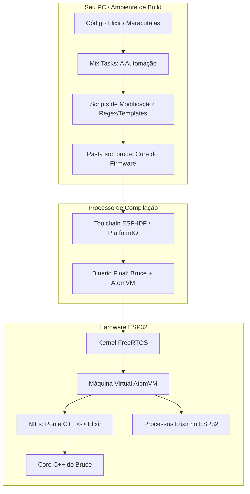

# Bruce Elixir - Firmware Predatório Híbrido (C++ & BEAM)

**Bruce Elixir** é um projeto revolucionário que fusiona o aclamado [firmware](https://github.com/BruceDevices/firmware) [Bruce Devices](https://github.com/BruceDevices) com a resiliência e elegância do ecossistema [Elixir](https://elixir.hexdocs.pm/introduction.html)/[Erlang](https://www.erlang.org/), criando uma plataforma de hardware hacking sem precedentes para microcontroladores [ESP32](https://pt.wikipedia.org/wiki/ESP32).

Ao unir o núcleo de alto desempenho em C/C++ do Bruce original com a máquina virtual [AtomVM](https://doc.atomvm.org/latest/index.html), este projeto habilita o desenvolvimento de ferramentas ofensivas automatizadas, scripts dinâmicos de Red Team e uma tolerância a falhas inédita para a turma de Hardware Hacking.

---

## 🧠 Arquitetura Híbrida: Como o Projeto Funciona

O Bruce Elixir não traduz código nem executa runtimes paralelos pesados. Em vez disso, opera como um sistema operacional híbrido em camadas, onde a BEAM (via AtomVM) assume o controle lógico do dispositivo, gerenciando e disparando os motores de ataque nativos escritos em C++.

```text
+-------------------------------------------------------+
|        Sua Aplicação Elixir (Suas Maracutaias)        |  <-- Código Elixir Dinâmico
+---------------------------+---------------------------+
|    Supervisores do Bruce  |   Subfunções Customizadas |  <-- Processos Elixir (BEAM)
+---------------------------+---------------------------+
|                        AtomVM                         |  <-- A Máquina Virtual (C)
+-------------------------------------------------------+
|  NIFs da Ponte (C++) <->  Core do Bruce (Drivers C++) |  <-- O "Kernel" do Bruce
+-------------------------------------------------------+
|         FreeRTOS (O micro-kernel do ESP-IDF)          |
+-------------------------------------------------------+
```

### 🎯 Camada Base: FreeRTOS & Core do Bruce (C++)

O firmware original do Bruce, construído sobre o ESP-IDF/Arduino, atua como o motor de hardware. Os drivers de rádio (CC1101), stacks de Wi-Fi e BLE, e controladores de periféricos (telas TFT, teclados do Cardputer/T-Deck) permanecem nesta camada estática de alta performance.

### ⚡ Meio de Campo: AtomVM Customizada & NIFs

A máquina virtual AtomVM é compilada diretamente com o core do Bruce. Funções nativas são expostas ao Elixir através de NIFs (Native Implemented Functions). Quando o Elixir executa um comando de ataque, a AtomVM realiza chamadas de memória direta para as funções em C++.

### 🧩 Topo: Orquestração e Processos Elixir

A lógica de negócios, automações e inteligência de ataque rodam como processos isolados dentro da BEAM. É aqui que suas customizações ganham vida através de árvores de supervisão e concorrência real.

---

## 🔥 Recursos e Vantagens do Ecossistema Elixir

Unir o Bruce com a BEAM adiciona superpoderes ao arsenal original de Red Team:

### 🛡️ Tolerância a Falhas Extrema (Crash Protection)
Ataques de rádio e injeções de pacotes Wi-Fi frequentemente causam estouro de buffer e travamentos. Se uma subfunção ou automação em Elixir falhar, a árvore de supervisão derruba apenas aquele processo e o reinicia instantaneamente, sem travar o hardware ou interromper outros ataques em execução.

### 🔄 Injeção de Código Dinâmico (Hot Reloading)
Através da AtomVM, é possível atualizar regras de filtragem, payloads de BadBLE ou scripts de ataque salvos no cartão SD sem precisar reflashar o microcontrolador inteiro.

### 🎯 Pattern Matching Estrutural
Analisar pacotes capturados por sniffers ou respostas de dumps de RFID usando as estruturas nativas do Elixir torna a criação de exploits automatizados muito mais rápida do que manipular ponteiros em C puro.

### ⚡ Concorrência Real
Processos Elixir leves permitem executar múltiplos ataques simultaneamente: enquanto um processo faz Deauth Flood, outro pode estar escaneando BLE e um terceiro gravando logs no SD, tudo sem interferência.

---

## 📡 Capacidades de Hardware Herdadas do Core

O projeto herda a compatibilidade e o portfólio de ataques do firmware Bruce original para dispositivos como:

**Dispositivos Suportados:**
- M5Stack Cardputer, StickC Plus2, M5Core2
- Lilygo T-Deck, T-Embed
- Placas customizadas com ESP32

**Stack de Ataques:**

| Categoria | Capacidades |
|-----------|-------------|
| **Wi-Fi** | Beacon Spam, Deauth Flood, Target Attacks, Rogue AP com Evil Portal, Wardriving, RAW Sniffer, Wireguard Tunneling |
| **BLE** | Scanners de proximidade, BadBLE (Ducky Scripts sem fio), Spam de emparelhamento (iOS/Windows/Android) |
| **RF/Sub-GHz** | Cópia, análise de espectro, Jammer completo/intermitente, replay de sinais (CC1101/RF433) |
| **RFID/NFC** | Leitura, clonagem e escrita de tags 125kHz, suporte a PN532 |
| **Infravermelho** | TV-B-Gone, gravação/replay de protocolos (NEC, Samsung, Sony) |

---

## 🚀 Fluxo de Desenvolvimento Local

O repositório utiliza o ecossistema do `mix` para coordenar tanto o código Elixir quanto o gerenciamento dos fontes em C++ do Bruce.

### 📦 Configuração Inicial

O código nativo do Bruce Devices é mantido isolado como um submódulo do Git na pasta `src_bruce` para facilitar a sincronização de atualizações:

```bash
# Clonar o projeto e trazer o firmware do Bruce automaticamente
git clone --recursive https://github.com/morteerror404/bruce_elixir.git
cd bruce_elixir
```

### 🛠️ Comandos Essenciais do Ambiente

```bash
# Baixar dependências do Elixir
mix deps.get

# Compilar as lógicas locais
mix compile

# Gerar o arquivo compactado .avm com suas lógicas Elixir
mix atomvm.pack

# Build completo do firmware (compila C++ + empacota Elixir)
mix bruce.build --target esp32_s3
```

---

## 🏗️ Estratégia de Modificação do Firmware

Diferente de abordagens tradicionais, o Bruce Elixir usa o Elixir como **pré-processador de build**, permitindo modificar o comportamento do firmware sem corromper o submódulo original.

### 🔄 Pipeline de Build Automatizado



### 🎯 Estratégia do "Patch de Build"

Em vez de editar arquivos originais, o processo segue este fluxo:

1. **Cópia Temporária**: Scripts Elixir copiam arquivos críticos do `src_bruce` para `build_workspace/`

2. **Injeção Programática**: O Elixir manipula os arquivos copiados usando regex e templates para injetar código necessário:
   - Inserir cabeçalho da AtomVM no `main.cpp`
   - Adicionar handlers personalizados para eventos (ex: interceptar pacotes RFID)
   - Configurar pinos e periféricos dinamicamente

3. **Compilação Dirigida**: O compilador aponta para `build_workspace/`, compilando o código modificado sem alterar o original

### 🔧 Modificação do Bootloader

Para personalizações avançadas:
- O ESP-IDF permite customizar a tabela de partições via arquivo `.csv`
- O script Elixir gera dinamicamente o layout da memória:
  - Partição para o core do Bruce
  - Partição para sistema de arquivos
  - Partição `data` exclusiva para o bytecode `.avm`
  - Partições para logs e armazenamento de capturas

### 🌉 Ponte NIFs (A Mágica da Integração)

Para que o Elixir controle o hardware:

1. Criamos uma biblioteca de ponte (`bruce_bridge.c`) usando `erl_nif.h`
2. O script de build detecta headers do Bruce em `src_bruce/include`
3. Lê assinaturas das funções de ataque (ex: `void deauth_target(mac_addr)`)
4. Gera automaticamente código C de ponte mapeando para AtomVM

**Exemplo de geração automática:**
```elixir
# Em Elixir, sua interface é limpa e declarativa
defmodule Bruce.WiFi do
  @moduledoc "Interface Elixir para ataques WiFi do core Bruce"
  
  # A ponte NIF é gerada automaticamente durante o build
  def deauth(target_mac, reason \\ 7) do
    :bruce_nif.deauth(target_mac, reason)
  end
  
  def beacon_spam(ssid_list, channel) do
    :bruce_nif.beacon_spam(ssid_list, channel)
  end
end
```

---

## 💻 Exemplo de Automação em Elixir

A verdadeira potência emerge quando combinamos a robustez do Elixir com o poder do hardware:

```elixir
defmodule RedTeam.Automation do
  use Supervisor
  
  # Árvore de supervisão - se qualquer ataque falhar, reinicia automaticamente
  def init(_arg) do
    children = [
      {WiFi.Deauth, [targets: ["AA:BB:CC:DD:EE:FF"], intensity: :high]},
      {BLE.BadUSB, [payload: "payloads/reverse_shell.ducky"]},
      {RF.Sniffer, [frequency: 433.92, log_to: "/sd/captures.log"]},
      {IR.TV_B_Gone, [interval: :every_5_seconds]}
    ]
    
    Supervisor.init(children, strategy: :one_for_one)
  end
  
  # Pattern matching para análise de pacotes capturados
  def handle_packet({:wifi, :beacon, ssid, bssid, rssi}) do
    if String.contains?(ssid, "Target") do
      # Ataque direcionado automaticamente
      WiFi.deauth(bssid)
      log_attack(:deauth, bssid, rssi)
    end
  end
  
  def handle_packet({:rf, :raw, data}) do
    # Replay automático de sinais suspeitos
    if is_suspicious_pattern?(data) do
      RF.replay(data, times: 10)
    end
  end
end
```

---

## 🎯 Casos de Uso e Aplicações

### 🔬 Pesquisa de Segurança
- Testes automatizados de resistência de redes
- Coleta e análise massiva de dados de wardriving
- Validação de protocolos de autenticação

### 🛡️ Red Team Operations
- Implantações stealth com failover automático
- Ataques coordenados multi-vector
- Adaptação dinâmica baseada em respostas do alvo

### 🏫 Educação e Treinamento
- Ambiente controlado para demonstrações de segurança
- Simulação de ataques complexos
- Aprendizado de conceitos de Red Team

---

## 🔧 Requisitos de Build

**Dependências:**
- Elixir 1.15+
- ESP-IDF 5.0+
- PlatformIO Core
- Git LFS (para assets grandes)

**Hardware Recomendado:**
- ESP32-S3 com pelo menos 8MB de Flash
- Display TFT (opcional, para interface visual)
- Módulos RF (CC1101/PN532 conforme necessidade)

---

## 🤝 Contribuindo

O projeto é aberto a contribuições! Áreas de foco:

1. **Novos NIFs**: Expor mais funções do core Bruce para Elixir
2. **Automações**: Scripts de ataque complexos usando padrões Elixir
3. **Otimização**: Reduzir overhead da AtomVM em operações críticas
4. **Documentação**: Tutoriais e exemplos de uso
5. **Portabilidade**: Suporte a novos dispositivos ESP32

---

## 📜 Licença

Este projeto é distribuído sob licença MIT, permitindo uso comercial e modificação livre.

---

## ⚠️ Aviso Legal

**Este software é fornecido apenas para fins educacionais e de pesquisa de segurança.** O uso indevido para ataques não autorizados é estritamente proibido. O usuário é o único responsável por garantir conformidade com leis locais e regulamentações aplicáveis.

---

## 🌟 Roadmap

- [ ] Suporte a OTA updates para atualização do bytecode Elixir
- [ ] Interface Web para monitoramento remoto (via Elixir Phoenix)
- [ ] Machine Learning para detecção de padrões de ataque
- [ ] Cluster de dispositivos Bruce coordenados via Elixir nodes
- [ ] Integração com ferramentas de OSINT

---

**Bruce Elixir**: Onde a resiliência da BEAM encontra a brutalidade do hardware hacking.
